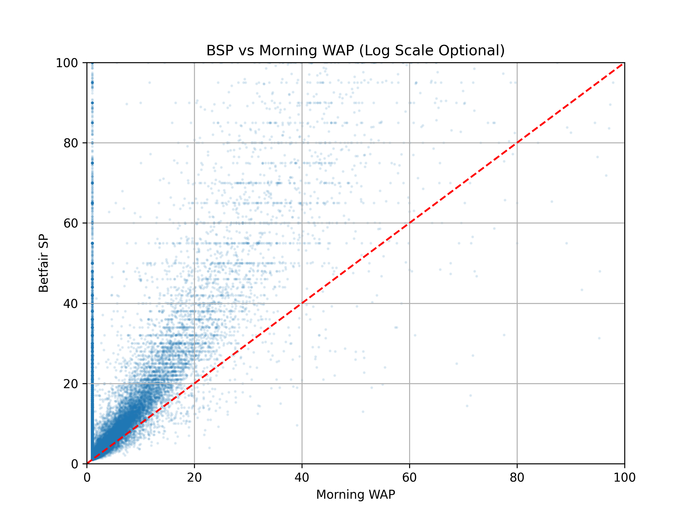
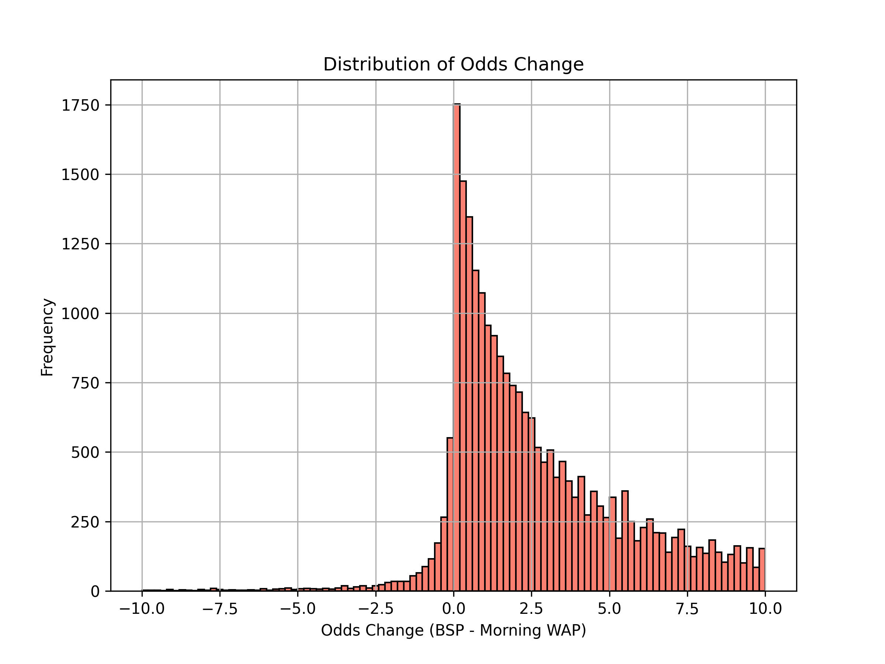
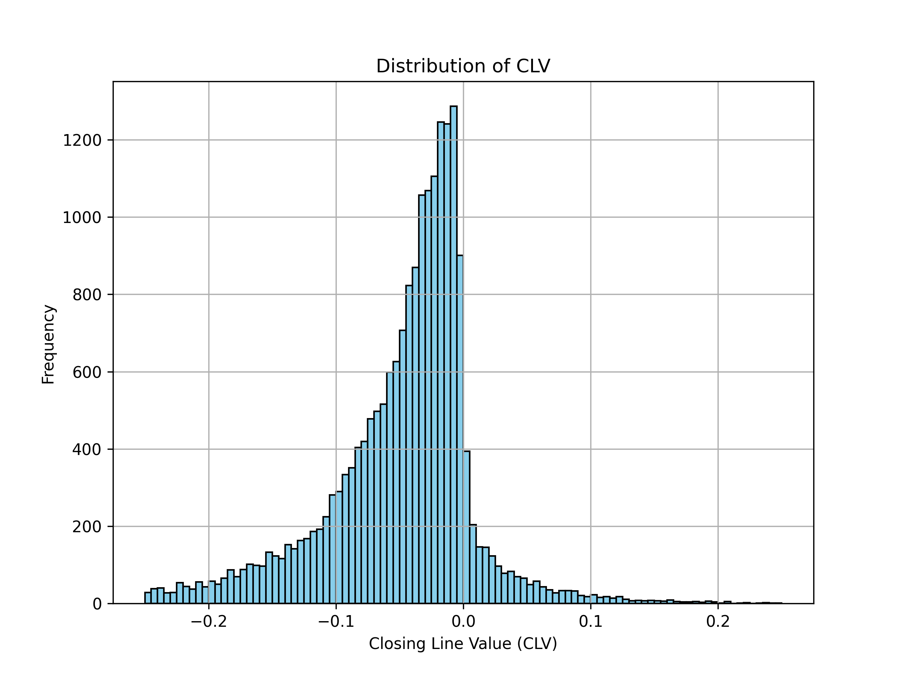
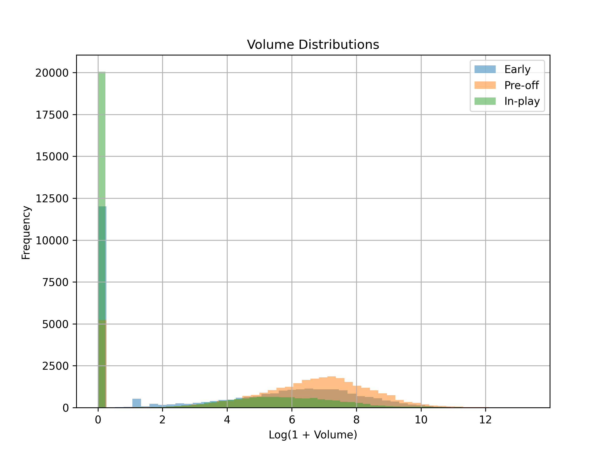

# Betfair Pricing & Strategy Analysis Report

## Strategy Performance

The following table summarizes the performance of the backtested strategies:

| Strategy                         |   Bets |   Win Rate % |   Gross ROI % |   Net ROI % |   Avg CLV |   VW Net ROI % |
|:---------------------------------|-------:|-------------:|--------------:|------------:|----------:|---------------:|
| Fade Drifters (Lay)              |      0 |         0    |          0    |        0    |    0      |           0    |
| Follow Steam (Back)              |    168 |        25    |          3.31 |       -0.6  |    0.0552 |          18.76 |
| Longshot Bias (Back >15, Lay <3) |  16368 |        22.52 |         -8.87 |      -12.26 |   -0.274  |          -4.48 |

### Top Strategies by Net ROI:
- **Fade Drifters (Lay)**: 0.0% Net ROI over 0 bets.
- **Follow Steam (Back)**: -0.6% Net ROI over 168 bets.
- **Longshot Bias (Back >15, Lay <3)**: -12.26% Net ROI over 16368 bets.

## Data Visualizations

### Odds Change & BSP vs Morning WAP

### Closing Line Value (CLV)

### Volume Dynamics

