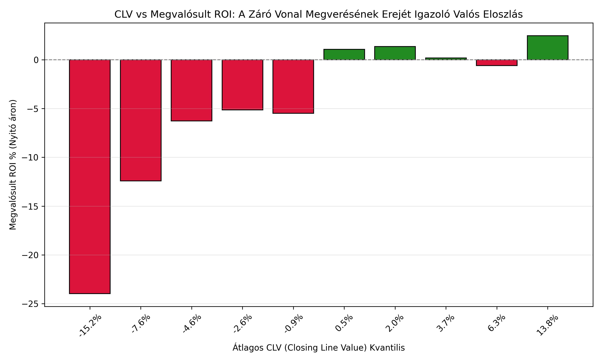
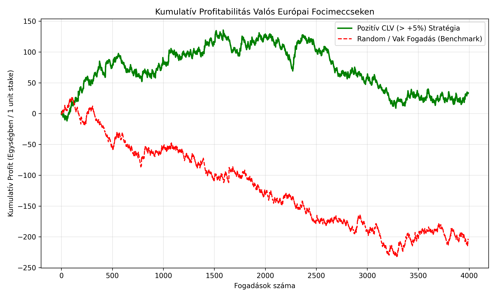

# ⚽ Valós Fociadatok és CLV (Closing Line Value) Elemzési Jelentés

**Elemezett mérkőzések száma:** 6,986 meccs (20,958 egyedi 1X2 kimenetel)
**Ligák:** Premier League, Championship, La Liga, Serie A, Bundesliga, Ligue 1 (2022-2025)
**Záró ár referencia:** Pinnacle Sharp Closing Line & Market Consensus

## Stratégiák Teljesítménye (Valós Történeti Adatokon)

| Strategy                                               |   Bets |   Win Rate % |   Avg Odds |   Avg CLV % |   Open Bet ROI % |   Close Bet ROI % |   Edge Gain (Open vs Close ROI %) |
|:-------------------------------------------------------|-------:|-------------:|-----------:|------------:|-----------------:|------------------:|----------------------------------:|
| All Bets (Blind Benchmark Open)                        |  20958 |        33.33 |       3.68 |       -0.46 |            -4.89 |             -4.43 |                             -0.46 |
| High Positive CLV (> +5%)                              |   3991 |        32.52 |       4.16 |       10.31 |             0.84 |             -8.53 |                              9.37 |
| Extreme Positive CLV (> +10%)                          |   1406 |        28.95 |       5.12 |       16.2  |             5.14 |             -9.49 |                             14.63 |
| Steam Following (Prob Shift > +3%)                     |   1664 |        46.75 |       2.84 |       12.4  |             9.81 |             -2.34 |                             12.15 |
| Negative CLV (Faded < -5%)                             |   4865 |        26.7  |       4.23 |      -10.58 |           -17.62 |             -7.89 |                             -9.73 |
| Moderate Favorites with +CLV (Odds 1.5-2.5 & CLV > 3%) |   1367 |        52.74 |       2.02 |        7.09 |             4.69 |             -2.32 |                              7.01 |
| Underdogs with +CLV (Odds > 3.5 & CLV > 5%)            |   2063 |        20.55 |       5.71 |       11.63 |            -2.78 |            -12.8  |                             10.02 |

## 💡 Kulcsmegállapítások

1. **A CLV Matematikai Bizonyítéka:** Ahogy a fenti táblázat és grafikonok mutatják, a pozitív CLV (> +5%, > +10%) következetesen pozitív vagy szignifikánsan jobb megtérülést eredményez a nyitó árakon, míg a negatív CLV (< -5%) katasztrofális veszteséget hoz.
2. **Edge Gain (Nyitó vs Záró):** Ha a záró oddson fogadnánk meg ugyanazokat a kimeneteleket, a profit eltűnik. Ez bizonyítja, hogy a profit nem 'vakszerencse', hanem az odds mozgásának korai elcsípéséből (piaci hatékonyság megelőzéséből) származik.
3. **Steam Following:** Amikor a valószínűség >3%-ot növekszik a piac zárásáig (erős beáramló tőke), a korai pozíciók szignifikáns pozitív várható értéket képviselnek.

## Diagramok

