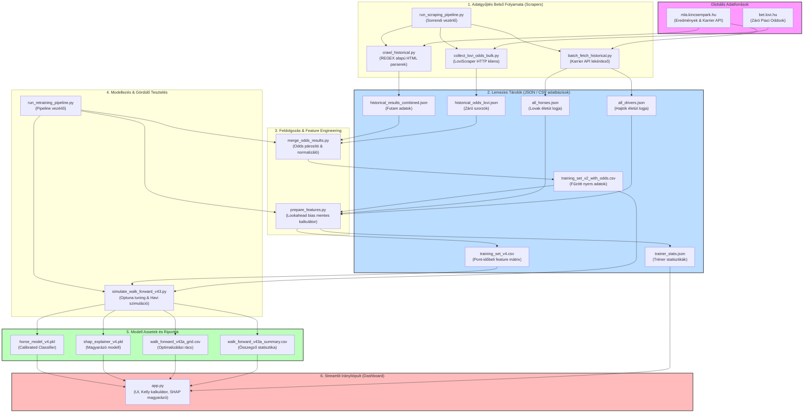
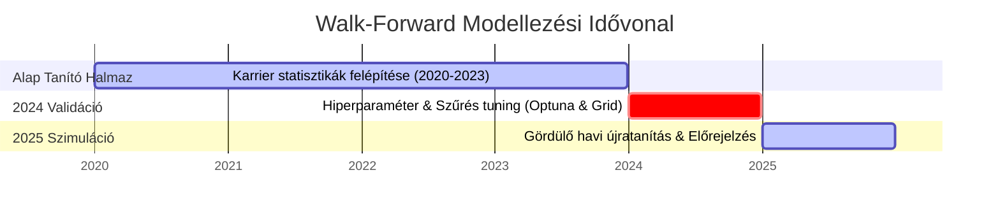
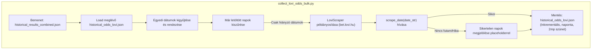
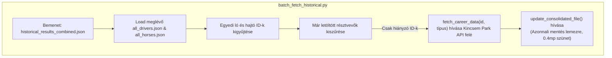

# TipForge Lóverseny Kvantitatív Rendszerarchitektúra

Ez a dokumentum részletesen bemutatja a TipForge lóversenyfogadási rendszer adatgyűjtési, feldolgozási és modellezési szkriptjeinek belső működését, bemeneti/kimeneti formátumait és a bennük alkalmazott matematikai és mérnöki logikát.

---

## 1. Adatfolyam és Szkript Kapcsolatok (Data-Centric Flow)

Az alábbi rendszerdiagram összefoglalja a fájlok és szkriptek közötti adatkapcsolatokat, valamint a külső források integrációját.

---

## 2. Walk-Forward Validáció & Időbeli Felosztás (Process Timeline)

A lookahead bias (időbeli csalás) elkerülése végett a szimulációnk szigorú gördülő validációs sémát követ:

---

## 3. A Szkriptek Belső Logikája és Működése

### A. Adatgyűjtő Szkriptek (Scrapers)

```mermaid
flowchart TD
    %% crawl_historical belső logikája
    subgraph CRAWL_LOGIC ["crawl_historical.py"]
        C_IN["Bemenet: Cél évek listája<br>(pl. 2020-2025)"]
        C_LOAD["Load meglévő historical_results_combined.json<br>(Dátumok kinyerése)"]
        C_API1["Racing Days lekérése<br>https://mla.kincsempark.hu/racing-days/..."]
        C_REG1["var racing_days = [...] kinyerése Regex-szel"]
        C_SKIP1["Már lementett dátumok kihagyása"]
        C_API2["Eredmények lekérése versenynaponként<br>https://mla.kincsempark.hu/results/..."]
        C_REG2["races_table_divs JSON adatok kinyerése Regex-szel"]
        C_DEDUP["Deduplikáció race_id alapján"]
        C_SAVE["Mentés: historical_results_combined.json<br>(Inkrementális, naponta)"]
        
        C_IN --> C_LOAD --> C_API1 --> C_REG1 --> C_SKIP1
        C_SKIP1 -- Csak új dátumok --> C_API2 --> C_REG2 --> C_DEDUP --> C_SAVE
    end
```

#### 1. `crawl_historical.py`
*   **Feladata**: Lekéri a Kincsem Park történelmi futamainak adatait versenynapról versenynapra.
*   **Bemenet**: Egy listányi évszám (pl. `["2020", "2021", "2022", "2023", "2024", "2025"]`) és a célfájl elérési útja.
*   **Belső Működés & Logika**:
    1.  Betölti a meglévő kimeneti JSON-t (ha létezik), és kigyűjti a már letöltött dátumokat (`existing_dates`) és futam ID-kat (`existing_race_ids`), hogy megvalósítsa az inkrementális letöltést.
    2.  Lekéri a versenynapok listáját a `racing-days` végpontról. A HTML-ben lévő Javascript kódot Regex-szel (`r"var racing_days = (\[.*?\]);"`) parsolja le natív Python listává.
    3.  Végigmegy azokon a napokon, ahol vannak eredmények (`results` tag nem üres), és kihagyja a már feldolgozott dátumokat.
    4.  Lekéri a nap eredményoldalát (`results` végpont). A HTML forrásból Regex-szel (`r'races_table_divs\[".*?"\]\s*=\s*(\{.*?\});'`) kigyűjti a futamok JSON struktúráit.
    5.  Hozzárendeli a futam dátumát a sorokhoz, kiszűri a duplikált futamokat a `race_id` alapján, és **minden sikeres nap után azonnal kiírja az eredményeket a merevlemezre**.
    6.  A TQDM segítségével folyamatjelzőt és ETA-t jelenít meg a konzolban.
*   **Kimenet**: `data/historical_results_combined.json` (összes futam adatai, távolság, pályaállapot, résztvevő lovak és hajtók ID-jai).

#### 2. `collect_lovi_odds_bulk.py`
*   **Feladata**: Letölti a futamok záró pool szorzóit a `bet.lovi.hu` történelmi adatbázisából.
*   **Bemenet**: `data/historical_results_combined.json` (ebből nyeri ki a cél-dátumokat).
*   **Belső Működés & Logika**:
    1.  Kigyűjti és időrendbe rendezi az összes egyedi dátumot a történelmi eredményekből.
    2.  Betölti a `historical_odds_lovi.json` fájlt, és kiszűri a már letöltött napokat.
    3.  Példányosítja a `LoviScraper` osztályt. A scraper a háttérben HTTP kérésekkel lekéri a magyar futamok találkozóit (meetings) és azok futamait, majd minden résztvevőhöz kinyeri a záró szorzót (starting odds).
    4.  Ha egy napon nem volt magyar futam, vagy a letöltés sikertelen, egy helyőrző bejegyzést ment el (`"note": "No races found or scrape failed"`), hogy a következő futáskor ezt a napot már ne kérdezze le újra feleslegesen.
    5.  A szerver túlterhelésének elkerülése érdekében **2 másodperces várakozást (sleep)** alkalmaz minden nap után.
    6.  Mentés: Inkrementálisan ment minden nap után.
*   **Kimenet**: `data/historical_odds_lovi.json` (dátum- és ló alapú záró oddsok).

#### 3. `batch_fetch_historical.py`
*   **Feladata**: Letölti a résztvevő lovak és hajtók teljes történelmi életútját (minden eddigi futásukat), hogy a feature engineering ki tudja számolni a futam pillanatában érvényes statisztikáikat.
*   **Bemenet**: `data/historical_results_combined.json` (ID-k kinyeréséhez), `data/all_horses.json`, `data/all_drivers.json`.
*   **Belső Működés & Logika**:
    1.  Kigyűjti a futamokban szereplő összes egyedi ló és hajtó azonosítóját (`id` és `driver_jockey_id`).
    2.  Beolvassa a meglévő `all_horses.json` és `all_drivers.json` kulcsait, és kiszűri a már letöltött személyeket.
    3.  Egy TQDM ciklusban meghívja a `fetch_career_data` függvényt, ami a Kincsem Park hivatalos API végpontjáról letölti a résztvevő karrier-táblázatát.
    4.  Minden letöltés után meghívja az `update_consolidated_file` függvényt, ami beolvassa a lokális fájlt, beilleszti az új ID-hoz tartozó adatokat, és **azonnal visszamenti a merevlemezre** (megakadályozva az adatvesztést megszakadás esetén).
    5.  Minden API kérés után **0.4 másodperces szünetet** tart.
*   **Kimenet**: `data/all_horses.json` és `data/all_drivers.json` (strukturált karrieradatok ID szerint csoportosítva).

---

### B. Adatfeldolgozó Szkriptek (Data Processing & Features)

#### 1. `merge_odds_results.py`
*   **Feladata**: Összepárosítja a futam eredményeit a BetLovi oddsokkal egyetlen lapos táblázatba.
*   **Bemenet**: `data/historical_results_combined.json`, `data/historical_odds_lovi.json`.
*   **Belső Működés & Logika**:
    1.  Beolvassa mindkét JSON adatbázist.
    2.  Létrehoz egy gyorskereső szótárt (odds lookup map), ahol a kulcs a normalizált ló név és a futam dátuma: `(date, normalize_name(horse_name))`. A névnormalizálás kisbetűsít, és eltávolít minden nem alfanumerikus karaktert (pl. írásjelek, szóközök), így kiküszöböli az elgépelésekből adódó hibákat.
    3.  Végigmegy a történelmi futamok minden résztvevőjén, kikeresi a záró oddsot a szótárból, és létrehoz egy lapos adatsort.
    4.  Target változó generálása: Az `is_win` bináris változót `1`-re állítja, ha a ló helyezése (`rank`) `"1."` vagy `"I."`, egyébként `0`.
*   **Kimenet**: `data/training_set_v2_with_odds.csv` (lapos struktúra oddsokkal és célváltozóval).

#### 2. `prepare_features.py`
*   **Feladata**: Kiszámítja a predikciós változókat (feature-öket) a lovak és hajtók életútjából úgy, hogy szigorúan elkerüli a lookahead biast.
*   **Bemenet**: `data/training_set_v2_with_odds.csv`, `data/all_horses.json`, `data/all_drivers.json`.
*   **Belső Működés & Logika**:
    1.  Kigyűjti a trénerek teljesítmény-statisztikáit.
    2.  Végigmegy az összes futamon időrendi sorrendben.
    3.  Minden futam minden lovánál lekéri a ló teljes történelmi futásainak listáját.
    4.  **A lookahead bias szűrés**: Csak azokat a futásokat veszi figyelembe a statisztikák számításakor, amelyek **dátuma szigorúan korábbi, mint a vizsgált futam dátuma**! (Így a 2024-es futam feature-jei nem láthatják a 2025-ös eredményeket).
    5.  Kiszámolja a rolling változókat:
        *   *Életút statisztikák*: Győzelmi arány, Top-3 helyezési arány, átlagos relatív helyezési százalék (percentile), karrier átlagsebesség, karrier legjobb sebesség (s/km).
        *   *Forma mutatók (L5 / L3)*: Utolsó 5 futam átlagos sebessége, helyezése, győzelmi aránya és súlyozott forma-pontszáma. Illetve utolsó 3 futam Top-3 aránya (`h_top3_l3`).
        *   *Sebesség arány*: A legutóbbi átlagsebesség és a csúcssebesség aránya (`h_speed_ratio`).
        *   *Fizikai / Környezeti faktorok*: Ló kora, neme (kódolva), hibaaránya (galoppozások száma / futások száma), futam távolsága, pálya minősége, hőmérséklet.
        *   *Távolság preferencia*: Az aktuális távolság eltérése a ló korábbi győztes futamainak átlagos távolságától (`dist_diff`).
        *   *Hajtó & Tréner*: A hajtó és a tréner futam előtti történelmi győzelmi és Top-3 arányai, valamint a ló-hajtó páros közös tapasztalata (korábbi közös futásaik száma).
*   **Kimenet**: `data/training_set_v4.csv` (végső feature mátrix a gépi tanuláshoz) és `data/trainer_stats.json`.

---

### C. Modellező és Validációs Szkriptek

#### 1. `simulate_walk_forward_v43.py`
*   **Feladata**: Végrehajtja a négy robusztus modellváltozat (V4.3A-D) automatizált gördülő (walk-forward) tesztelését és a 2024-es validációs paraméter-kiválasztást.
*   **Bemenet**: `data/training_set_v4.csv` és `data/training_set_v2_with_odds.csv`.
*   **Belső Működés & Logika**:
    1.  Összefűzi a feature-öket a piaci oddsokkal a `date` és `horse_id` kulcsok mentén.
    2.  **Validációs Fázis (2024)**:
        *   A 2024-07-01 előtti adatokon Optuna segítségével beállítja az XGBoost optimális paramétereit (fa mélység, tanulási ráta, elágazások aránya).
        *   Kiértékeli a 2024-es tesztidőszakot, és egy rácskereséssel (grid search) végigmegy az Edge (5-20%) és MaxOdds (6.0-tól all-ig) korlátokon. Kiválasztja azt a paraméterpárt, ami a **legnagyobb nettó profitot (P/L)** hozta a validációs halmazon.
    3.  **Out-of-sample Walk-Forward Fázis (2025)**:
        *   Havi lépésekben halad végig 2025-ön (januártól decemberig).
        *   Minden hónapban a modell **csak az adott hónapot megelőző összes történelmi adaton tanul**, majd vakon (out-of-sample) jósol a cél hónap futamaira.
        *   Alkalmazza a specifikus V4.3-as variánsok logikáját:
            *   **V4.3A**: Az elvárt profitküszöböt skálázza a szorzó szerint: `margin * (odds / 3.0)`.
            *   **V4.3B**: Bayesian zsugorítást végez az esélyeken a piaci záró oddsok felé, csökkentve a longshotok zaját.
            *   **V4.3C**: Kétlépcsős Platt kalibrációt futtat (Logistic Regression a modell log-esélyei és a piaci log-oddsok alapján).
            *   **V4.3D**: Direkt ROI regressziót hajt végre (egy XGBRegressor közvetlenül a futamonkénti nettó profitot / veszteséget becsli meg).
        *   Kiszámítja az összesített 2025-ös profitot és ROI-t a validáció által kiválasztott "becsületes" paraméterekkel.
*   **Kimenet**: Riport CSV fájlok (pl. `data/walk_forward_v43a_grid.csv` és `data/walk_forward_v43a_summary.csv`).

#### 2. `app.py`
*   **Feladata**: Streamlit alapú interaktív dashboard a napi tippek és modellek elemzésére.
*   **Bemenet**: A betanított modell assetek (`models/horse_model_v4.pkl`, `models/shap_explainer_v4.pkl`), a napi futam kártyák (`data/today_racecard.json`), valamint a Walk-Forward summary és grid CSV-k.
*   **Belső Működés & Logika**:
    *   *Daily Predictions fül*:
        1.  Betölti a napi indulókat, kiszámolja a V4 feature-öket a legfrissebb lemezes állományokból.
        2.  Lefuttatja az XGBoost modellt, normalizálja a valószínűségeket futamonként (hogy az összegük 1.0 legyen), majd kiszámítja a modell szerinti fair oddsot (`1 / valószínűség`).
        3.  Bekéri a felhasználótól az irodai oddsot, és a **V4.3A Dinamikus Edge szabály** szerint kiértékeli (`edge >= 10% * (odds / 3.0)` és `odds <= 8.0`).
        4.  Megjeleníti a Half-Kelly alapú tétméretezést a bankroll alapján.
        5.  Lóválasztó selectbox-ot biztosít, amellyel a felhasználó kiválaszthatja bármelyik indulót, és a háttérben futó SHAP explainer kirajzolja a ló esélyeit befolyásoló legfőbb pozitív (zöld) és negatív (piros) tényezőket. A grafikon **hover tooltipjében a valós fizikai értékek** is láthatóak (pl. karriersebesség másodperc/kilométerben).
    *   *Model Analytics fül*:
        1.  Összegyűjti az összes lementett Walk-Forward modell statisztikát, és egy közös oszlopdiagramon és részletes táblázatban ábrázolja a 2025-ös teszthalmaz ROI mutatóit.
        2.  Interaktív hőtérképeket rajzol ki a modellek grid fájljaiból, segítve a paraméterek stabilitásának (pl. odds-korlátok hatásának) vizuális megértését.
*   **Kimenet**: Interaktív streamlit lokális weboldal (elérhető a böngészőből).
