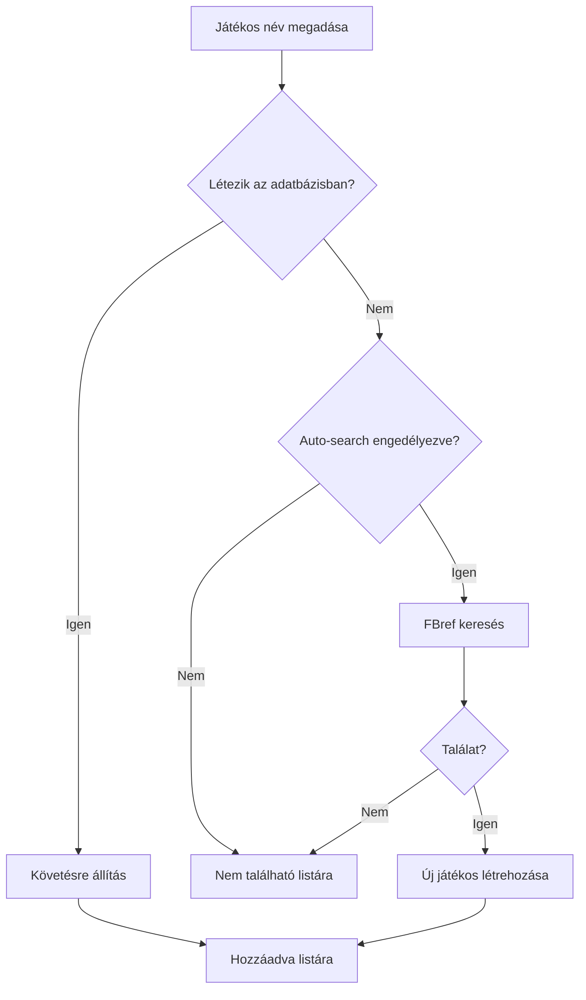
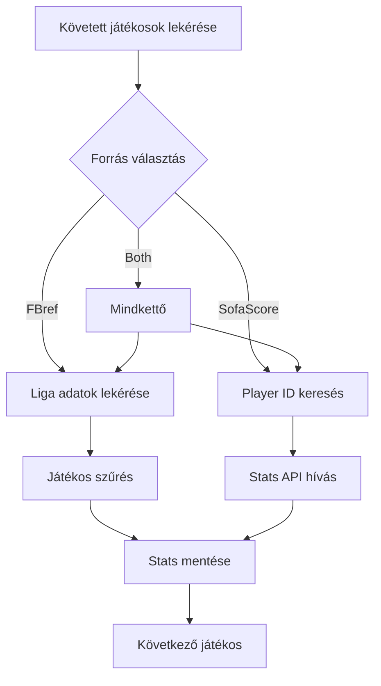

# Player Tracker - Játékos-specifikus Követés

## Áttekintés

A Player Tracker rendszer most már támogatja a **játékos-specifikus követést**, ahol konkrét játékosokat adhatsz meg név szerint, és a rendszer automatikusan leszedi az adataikat FBref-ről és SofaScore-ról.

## Funkciók

### 🎯 Játékos Hozzáadása
- Add meg a követni kívánt játékosok nevét
- Automatikus keresés FBref-en
- Automatikus párosítás meglévő játékosokkal
- Új játékosok létrehozása

### 📥 Adatok Frissítése
- Frissítsd az összes követett játékos adatait
- Válaszd ki a forrást (FBref, SofaScore, vagy mindkettő)
- Szezon-specifikus adatok FBref-ről

### 📋 Követett Játékosok Listája
- Nézd meg az összes követett játékost
- Gyors hozzáférés a részletes statisztikákhoz

## Használat

### Web UI

1. **Nyisd meg**: `http://localhost:8003/player_tracker.html`

2. **Játékosok hozzáadása**:
   ```
   Szabó Dominik
   Nagy Ádám
   Varga Barnabás
   Schäfer András
   ```
   - Írd be a neveket, soronként egyet
   - Pipáld be az "Automatikus keresés" opciót
   - Kattints "Játékosok Hozzáadása"

3. **Adatok frissítése**:
   - Válaszd ki a forrást (both/fbref/sofascore)
   - Opcionálisan add meg a szezont (pl. 2024-2025)
   - Kattints "Adatok Frissítése"

### API Használat

#### 1. Játékosok Hozzáadása

```http
POST /api/v1/tracker/add-players
Content-Type: application/json

{
    "player_names": [
        "Szabó Dominik",
        "Nagy Ádám",
        "Varga Barnabás"
    ],
    "auto_search": true
}
```

**Válasz**:
```json
{
    "status": "success",
    "added": ["Szabó Dominik", "Varga Barnabás"],
    "already_tracked": ["Nagy Ádám"],
    "not_found": []
}
```

#### 2. Adatok Frissítése

```http
POST /api/v1/tracker/fetch-data
Content-Type: application/json

{
    "source": "both",
    "season": "2024-2025"
}
```

**Válasz**:
```json
{
    "status": "success",
    "tracked_players": 3,
    "fetched_count": 6,
    "errors": []
}
```

#### 3. Követett Játékosok Listája

```http
GET /api/v1/tracker/tracked-players
```

**Válasz**:
```json
{
    "tracked_players": [
        {
            "id": 1,
            "name": "Szabó Dominik",
            "position": "MID",
            "team": "Ferencváros",
            "league": "NB I"
        }
    ],
    "total": 1
}
```

## Python Script Példa

```python
from app.database import SessionLocal
from app.services.player_tracker import PlayerTrackerService

db = SessionLocal()
service = PlayerTrackerService(db)

# Játékosok hozzáadása
players = ["Szabó Dominik", "Nagy Ádám", "Varga Barnabás"]
result = service.add_tracked_players(players, auto_search=True)

print(f"Hozzáadva: {result['added']}")
print(f"Már követve: {result['already_tracked']}")
print(f"Nem található: {result['not_found']}")

# Adatok frissítése
result = service.fetch_tracked_players_data(source="both", season="2024-2025")
print(f"Frissített adatok: {result['fetched_count']}")
```

## Működés

### 1. Játékos Hozzáadása



### 2. Adatok Frissítése



## Architektúra

```
backend/app/
├── services/
│   ├── player_tracker.py      # Player tracking service
│   ├── fbref_scraper.py        # FBref scraper
│   └── sofascore_scraper.py    # SofaScore scraper
└── api/
    └── tracker.py              # Tracker API endpoints

frontend/
└── player_tracker.html         # Player tracker UI
```

## Funkciók Részletesen

### PlayerTrackerService

**`add_tracked_players(player_names, auto_search)`**
- Játékosok hozzáadása követéshez
- Automatikus keresés FBref-en
- Fuzzy matching meglévő játékosokkal

**`fetch_tracked_players_data(source, season)`**
- Összes követett játékos adatainak frissítése
- Forrás választás (fbref/sofascore/both)
- Szezon-specifikus adatok

### Segédfüggvények

**`get_sofascore_player_id(player_name, team_name)`**
- SofaScore player ID keresés
- TLS client-alapú keresés
- Team name alapú szűrés

**`fetch_sofascore_player_stats(player_id, season)`**
- Játékos statisztikák SofaScore-ról
- Szezon-specifikus adatok
- Tournament-alapú bontás

## Példa Workflow

### 1. Magyar Játékosok Követése

```python
# Játékosok hozzáadása
hungarian_players = [
    "Szabó Dominik",
    "Nagy Ádám",
    "Varga Barnabás",
    "Schäfer András",
    "Szalai Attila"
]

service.add_tracked_players(hungarian_players, auto_search=True)

# NB I adatok frissítése
service.fetch_tracked_players_data(source="fbref", season="2024-2025")
```

### 2. Külföldi Légionáriusok

```python
# Külföldön játszó magyarok
abroad_players = [
    "Szoboszlai Dominik",  # Liverpool
    "Gulácsi Péter",       # RB Leipzig
    "Willi Orbán"          # RB Leipzig
]

service.add_tracked_players(abroad_players, auto_search=True)

# Big5 ligák adatai
service.fetch_tracked_players_data(source="both", season="2024-2025")
```

## Következő Lépések

1. **Teszteld a funkciót**:
   - Add hozzá kedvenc játékosaidat
   - Frissítsd az adataikat
   - Nézd meg a statisztikákat

2. **Automatizálás**:
   - Készíts cron job-ot napi frissítéshez
   - Állíts be értesítéseket kiugró teljesítményről

3. **Bővítés**:
   - Player comparison funkció
   - Form trend vizualizáció
   - Automated scouting reports

## Megjegyzések

- **FBref keresés**: Jelenleg placeholder, teljes implementáció Selenium-mal
- **SofaScore player ID**: Keresés API-n keresztül működik
- **Adatfrissítés**: Lehet lassú sok játékosnál (2-5 perc)
- **Liga párosítás**: Automatikus, de csak ismert ligákra

## Hibakeresés

Ha nem találja a játékost:
1. Ellenőrizd a név helyesírását
2. Próbáld meg a teljes nevet
3. Add hozzá manuálisan a Players oldalon
4. Állítsd követésre, majd frissítsd az adatokat

Ha nem frissülnek az adatok:
1. Ellenőrizd, hogy a játékos csapata/ligája ismert-e
2. Nézd meg az errors listát a válaszban
3. Próbáld meg külön FBref-et és SofaScore-t
